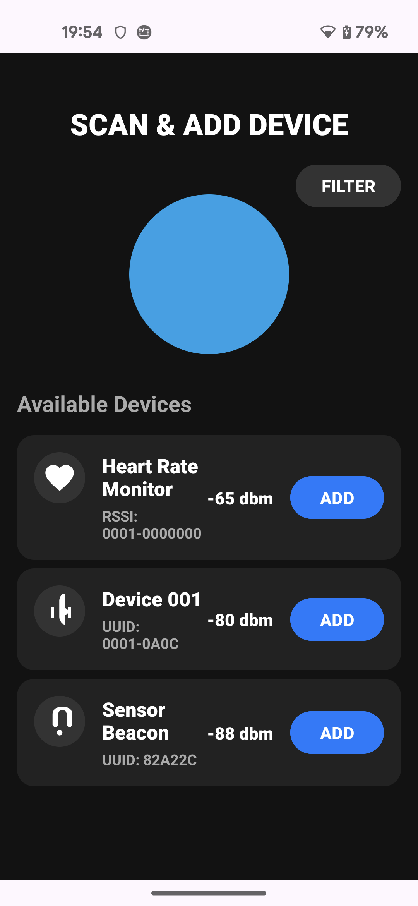

# Compare-CoolUI

かっこいいUIをChatGPT/Gemini/Copilotに作らせてみた。

## 命令文

命令文は以下の通り。

---

この画面をAndroid kotlinで作りたい。コードとxmlを教えて。

---

## 結果
| Copilot | Gemini | Chat GPT |
|---|---|---|
||||

## 感想

個人的には、CopilotとChatGPTがいい感じ。
Geminiは全般的に、言われたことを返事する感がある。
Copilotが一番元気がよくって、言われてないことも提案として出してくれる(ほとんどは余計なお世話だけど)。